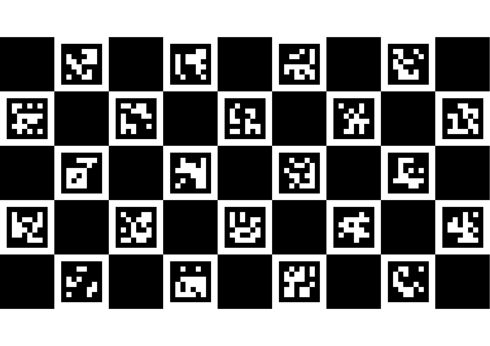
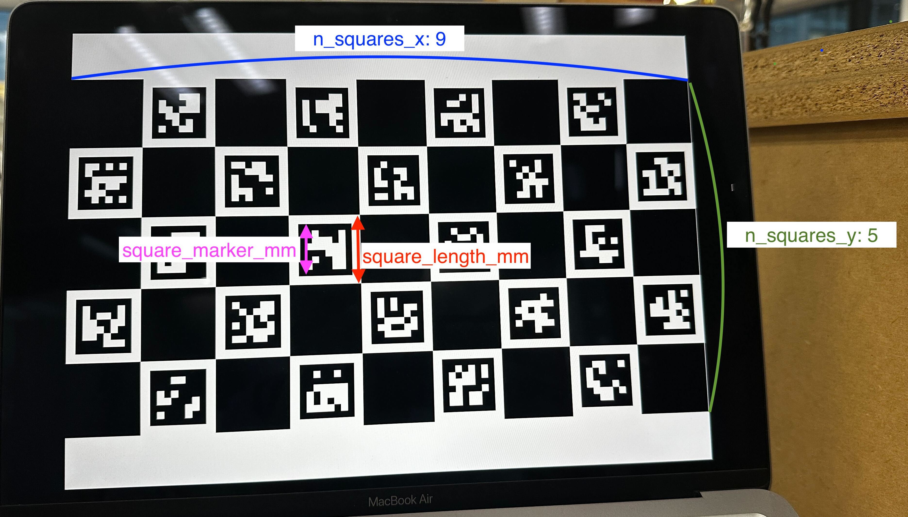
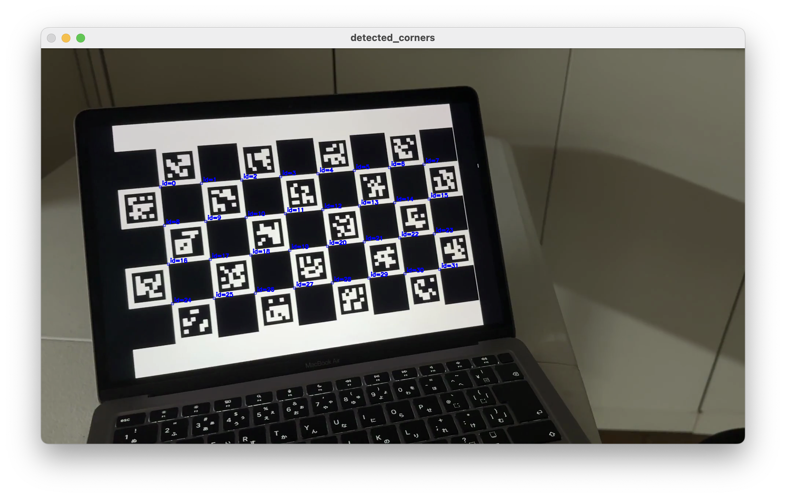
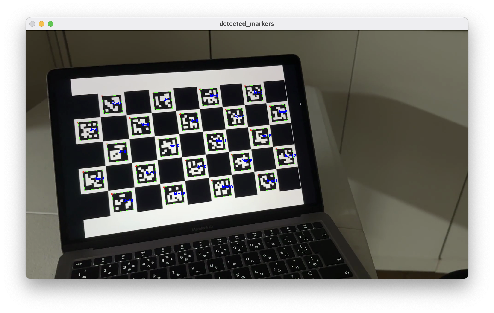

# Camera Calibration with ChArUco Board


This Python program performs camera calibration using a ChArUco board.  
It takes a video of a ChArUco board captured from different angles and computes the camera parameters, including the camera matrix and distortion coefficients. The output includes various calibration metrics such as re-projection error, field of view, and distances from the calibration board to the camera.

## Features

- **Input**: A video file of a ChArUco board and a configuration file in YAML format specifying calibration board parameters, camera parameters, and lens parameters.
- **Output**: A YAML file containing the calculated camera matrix, distortion coefficients, re-projection error, field of view, shift in the x and y directions, and statistics about the distance from the calibration board to the camera.
- **Capabilities**:
  - Computes camera intrinsic parameters and distortion coefficients.
  - Estimates the field of view of the camera.
  - Calculates mean distance, variance, and standard deviation of distances from the calibration board to the camera.
- **Limitations**:
  - Requires a clear view of the ChArUco board in the input video.
  - The accuracy of calibration depends on the variety of angles and distances of the ChArUco board in the video.

## Installation

1. Clone this repository to your local machine.
2. Ensure you have Python (>=3.6) installed.
3. Install the required Python libraries with the following command:
    ```bash
    pip install -r requirements.txt
    ```
   Since opencv-contrib-python changes significantly depending on the version, be sure to install the specified version.


## Usage
1. Generate a ChArUco board by following:
      ```bash
      python generate_charuco_board.py
      ```
    Important parameters for the later proesses are `dictionary_name`, `n_squares_x`, `n_squares_y`.  
    Depending on the printing or display environment, you can change these parameters in the script.


1. Print (or display) the generated board and measure the size of the squares and markers on the ChArUco board as following image
  
1. Fill in the configuration YAML file with the measured values and other camera/lens information. Details can be found in the sample configuration file [sample_calibration_input.yaml](./sample_calibration_input.yaml).
1. Prepare a video of a ChArUco board captured from different angles.
1. Run the Python program with the following command:
    ```bash
    python camera_calibration_charuco.py -i <input_video_file> -c <config_file>
    ```
    - Other optional arguments are available. Use the `-h` or `--help` argument to see the list of available arguments and their descriptions.
    - If you set the `-s` or `--show_image` argument, you can see the detected ChArUco corners and markers in the video.
    
    
1. The output will be saved in a YAML file with the same name as the input video file, but with the extension `_<date>.yaml`. Sample example: [sample_calibration_input_results_20240210_2131.yaml](./sample_calibration_input_results_20240210_2131.yaml).
    ```yaml
   results:
      rms_re-projection_error: 0.26777140119683945
      n_max_frames_found_corners: 284.0
      distance_calibration-board_to_camera_mean_m: 0.5121423266069415
      distance_calibration-board_to_camera_variance_m: 4.208706037840039
      distance_calibration-board_to_camera_stddev_m: 2.051513109351251
      camera_matrix:
        fx: 1607.4025495276107
        fy: 1608.761170963441
        cx: 952.2048015378278
        cy: 554.0910705554674
      distortion:
        k1: 0.18366428457772616
        k2: -0.4113908834080119
        p1: 0.000821760714944192
        p2: -0.0016385948524118023
        k3: -0.21986257700539644
      horizontal_fov: 61.69440849405533
      vertical_fov: 37.10989112640689
      horizontal_shift: -0.004059999199047996
      vertical_shift: 0.013047287551358661

## Note
- The camera information in the video included as a sample and the sample config yaml are actually different camera information. Please use this file as a reference only to check the operation of the code.